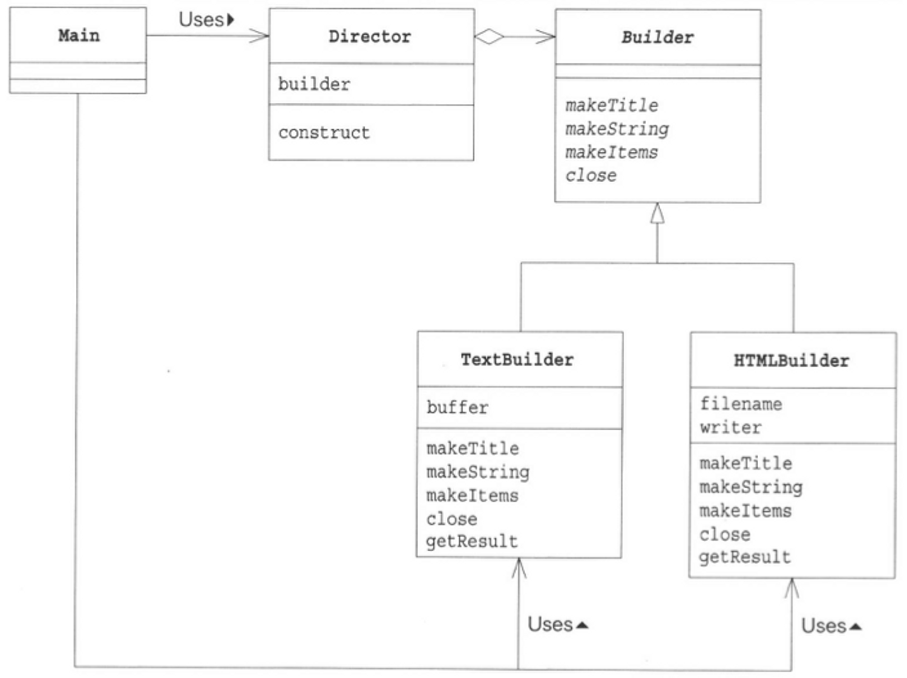
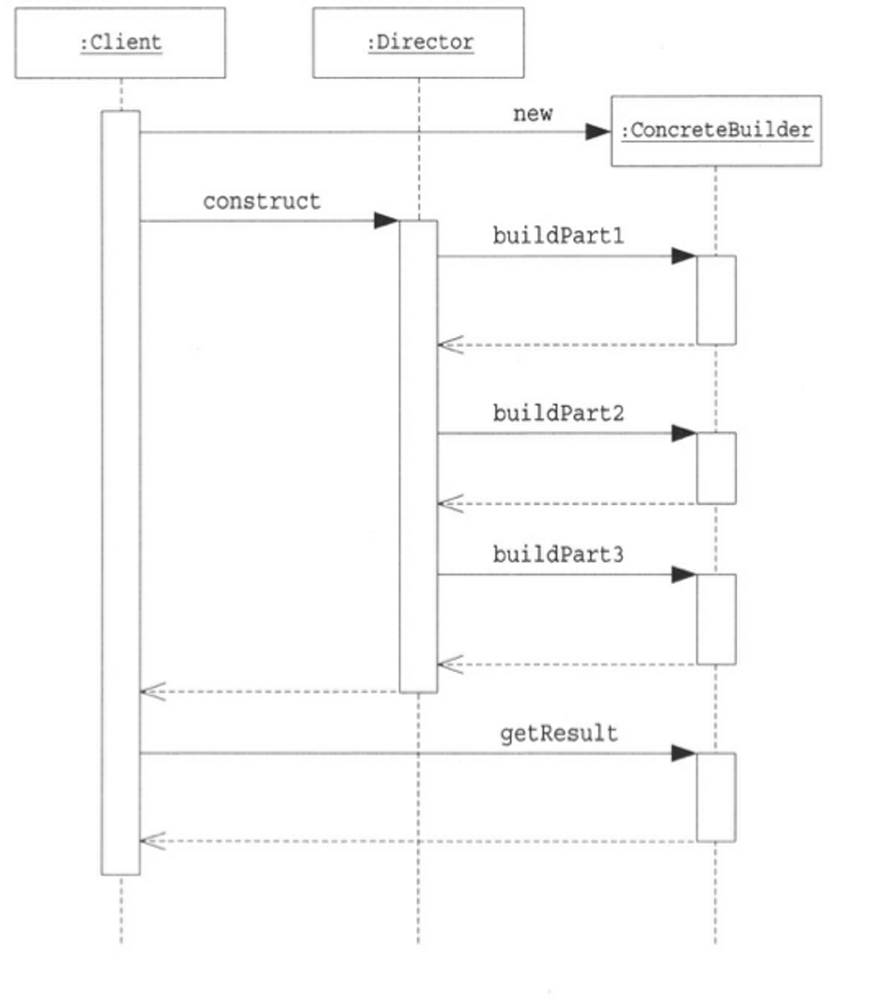

- Builder : 문서를 구성하기 위한 메소드를 결정하는 추상 클래스

- Director : 한 개의 문서를 만드는 클래스

- TextBuilder : 일반 텍스트(보통의 문자열)를 이용해서 문서를 만드는 클래스

- HTMLBuilder : HTML 파일을 이용해서 문서를 만드는 클래스

- Main : 동작 테스트용 클래스

### 클래스 다이어그램

## 시퀀스 다이어그램

## 결론
OOP에서 "누가 무엇을 알고 있을까?" 라는 주제는 매우 중요한 주제이며, 어떤 클래스가 어떤 메소드를 사용할 수 있는가에 대해 주의해야 한다.

예시코드를 보자면 Main은 Builder 클래스의 존재를 알지 못하며 Builder 클래스를 직접 적으로 호출하지 않는다.
단지, Builder 클래스를 상속받는 하위 클래스의 Override된 메소드를 호출할 뿐이다.
그렇기에 하위 클래스에서 모든 로직이 수행된다.

하지만 하위클래스의 경우엔 Builder 클래스를 직접적으로 알고있으며 메소드를 사용하지만, 자신이 실제로 이용하는 클래스가 TextBuilder 인지, HTMLBuilder 인지 또는 다른 Builder의 하위클래스인지 모른다.
이처럼 Director 클래스가 자신이 이용하고 있는 Builder 클래스의 하위 클래스를 모르기 때문에 교체가 가능하며,  내부에서 Builder가 아닌 TextBuilder나 HTMLBuilder를 사용하게 될 경우 강결합하게 되어 다른 인스턴스로 교체를 할 수 없게 된다.
이처럼 항상 결합도를 낮춰서 교환가능성을 높힐수 있도록 설계를 할 필요가 존재한다.