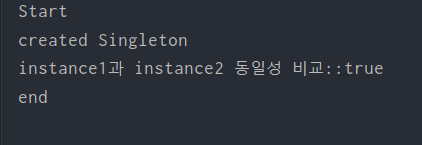

# 예제 코드 요구사항

싱글톤은 그 이름에 맞게 1개의 인스턴스만 생성을 해야하므로 1개의 클래스만을 필요로한다.

- **클래스별 역할**
  - Singleton
  ⇒ Singleton 패턴에는 Singleton의 역할만이 존재한다. Singleton 의 역할은 유일한 인스턴스를 얻기 위한 static 메소드를 가지고 있습니다. 이 메소드는 언제나 동일한 인스턴스를 반환하게된다. 

- **언제 생성되는가?**
=> 실행결과를 보면 `created Singleton` 이라는 메세지가 `Start` 이후 출력되게된다. 이를 통해 프로그램 실행 후 최초로 getInstance 메소드가 호출될 때 Singleton 클래스가 초기화되고 static 필드의 초기화도 이루어지면서 유일한 인스턴스가 생성되는 것을 확인할 수 있다.

## 장점
1. 외부에서 생성이 불가하다.
2. 고정된 영역에 미리 할당한다.
3. 고정된 영역에 할당하기에 메모리 낭비가 없다.
4. JVM 종료전까지 사용가능

